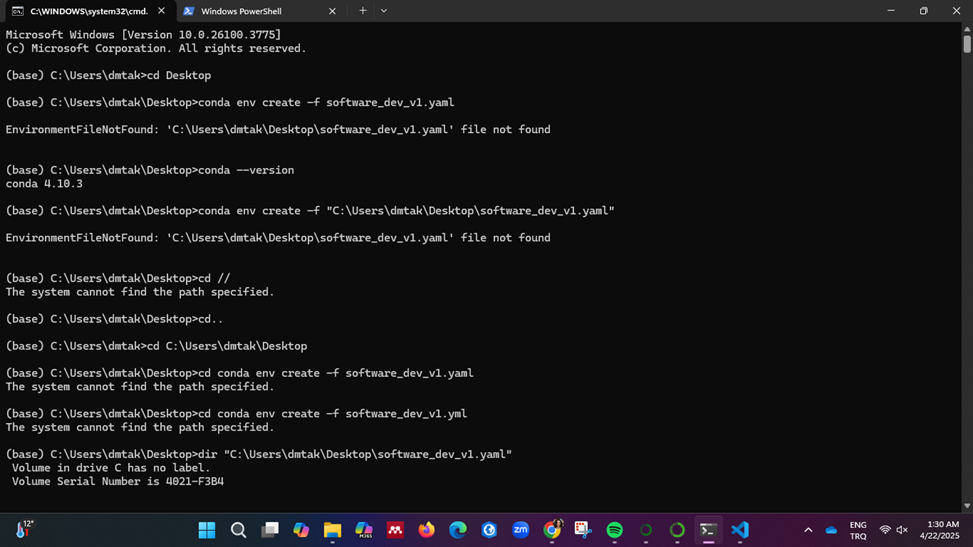

# geo-software-dev
I recreated the 2 .yml files I downloaded for this assignment with Conda. The commands I used while doing this are in the screenshots, and I did not receive any error messages. I uploaded all the details about the assignment to VisualStudioCode and then pushed it to GitHub. You can review the screenshots below for all the details I did in this assignment.

